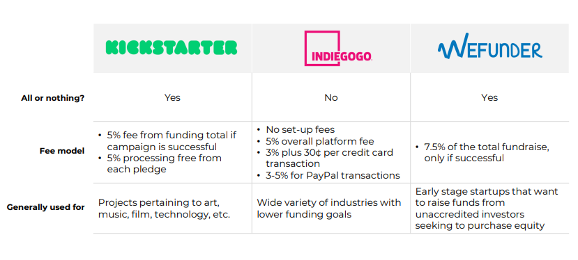
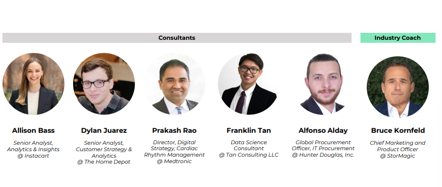

# Kickstarter Analytics

## COMPANY OVERVIEW
**Kickstarter is a public benefit online crowdfunding platform for creative projects**
* Value proposition: Project creators use the platform to raise money for their creative goals, while backers support creators by investing in projects. Creators choose what backers get in return for their contribution (e.g., a handwritten note).
* Profit System: Using an all-or-nothing model, Kickstarter captures 10% of total funds raised for successful projects (5% from backers, 5% from creators).
* Critical Resources: Kickstarter has technology expertise across development, design, and customer support. They also have a strong brand reputation and vast backer network - 22,304,080 total backers since their launch in 2009.

## PROBLEM STATEMENT
**Over half of all Kickstarter projects fail, which impedes growth and brand reputation**
* 59% of Kickstarter projects fail, which may lead to:
 * Decreased satisfaction and trust among backers, making them less likely to re-use the platform in the future.
 * Frustration and potential defection from creators who spent a lot of time, effort, and personal funds on their projects.
 * Increased risk of creators choosing to work with competitors* (e.g., Indiegogo, WeFunder) on future projects.
 * Lost revenue for Kickstarter, since the platform captures 10% of total funds raised for successful projects.

## WHY IT MATTERS
**Kickstarter leaves ~$4.2M in revenue on the table every year due to failed projects**
* $41,785,714 (average annual unsuccessful pledged dollars) x 10% (Kickstarter’s share)
* $4.2M (missed annual revenue opportunity)

## KEY QUESTIONS
**Understanding what impacts failure can help Kickstarter with value capture**
* What factors impact project failure? How can Kickstarter leverage this information to increase project success and achieve long-term growth?
* SEASONALITY: Does seasonality play a role in project failure?
* BACKERS: Does the number of backers have a significant impact on a project’s likelihood of failure?
* FUNDING GOALS: Are projects with higher funding goals at an increased risk of project failure?

## CLASSIFICATION METHODOLOGY
**To answer our key questions, we leveraged Kickstarter Data to understand project failure**
1. Data preprocessing
2. Feature engineering
3. Data splitting and cross-validation
4. Model training
5. Model evaluation
6. Hyperparameter tuning
7. Model deployment
8. Feature importance analysis
9. Season decomposition
Outputs: Probability of failure, feature importance, and seasonality

## MODEL OVERVIEW AND APPROACH
**We developed 3 models; LightGBM was the most performant**
* 94% accuracy with LightGBM
* Logistic regression and Decision Tree achieved 92% and 90% accuracy, respectively

## KEY FINDINGS
**1 Average pledge amount and number of backers follows a seasonal pattern**
* December consistently shows the lowest average pledge amount and backer count, indicating a less favorable time for campaigns.
* Average pledge amount and backer count sees a strong uptick in January and remains relatively stable throughout the following months.

**2 Number of backers is one of the most important drivers of success**
* More Organic Backers: Kickstarter should pursue strategies that attract and engage more organic backers to their platform.
* Increased Likelihood of Backing: A high initial backer count on a project acts as social proof, increasing the likelihood of additional backers.
* Project Success: Higher backer count contributes to achieving this goal, as each backer's contribution moves the project closer to its funding target.

**3 Projects with higher funding goals are less likely to succeed**
* This finding highlights the importance of project creators setting realistic and attainable funding goals.

## STRATEGIC IMPLICATIONS
**Kickstarter can modify their go-forward strategy to increase likelihood of success**
* Where should Kickstarter be headed? Use data to steer the platform experience to ensure the best possible project outcome and network effects under the optimal conditions
* What will Kickstarter need to deliver? Attract more organic backers to increase overall success rate, Help creators set more realistic project goals, Adjust marketing activities based on seasonality trends
* How can Kickstarter make it happen?
 * Combat Seasonality Attempt to defer high-risk projects until optimal months to increase likelihood of success and higher backer participation
 * Optimize Goals Provide recommendations to creators to ensure project goals are structured toward successful outcomes
 * Increase Backers Curate personalized marketing activities around high-value backer segments
 * Drive Engagement Introduce incentives to creators to launch with Kickstarter marketing events

## DATASET
**Our dataset had 13 total columns with 378,661 rows**
* [_Kickstarter Projects_](https://www.kaggle.com/datasets/kemical/kickstarter-projects) by Mickael Mouille

## COMPETITIVE ANALYSIS
**Other crowdfunding platforms have similar experiences but different target markets**

## CHALLENGES
**Limited causal insights, hidden population nuances, and unvalidated tactics**
1. Lack of temporal information and experimental design hinders the establishment of causal relationships. The dataset is historical, capturing Kickstarter projects at a single point in time. It lacks temporal information, so it can show associations and correlations between variables, but cannot establish pure causal relationships.
2. Population heterogeneity masks important distinctions that may influence the outcomes. The dataset may overlook individual differences and variations across subgroups with the population, masking important distinctions that may influence the outcomes.
3. More information is required to validate one day promotion tactics. This recommendation uses reasonable assumptions to achieve increased engagement.
 * Reduced fees: Creators & backers respond to an increase in purchasing power.
 * Enhanced backer reward: Backers are motivated by better rewards.
 * Top-Backer: Backers care about recognition.
 * 
## MEET OUR TEAM

* Business Scientists/Analysts:
  * [Allison Bass, Senior Analyst, Analytics & Insights at Instacart](https://www.linkedin.com/in/allisonhbass/)
  * [Dylan Juarez, Senior Analyst, Customer Strategy & Analytics at The Home Depot](https://www.linkedin.com/in/dylan-juarez-318192151/)
  * [Prakash Rao, Director, Digital Strategy, Cardiac Rhythm Management at Medtronic](https://www.linkedin.com/in/prakashrao23/)
  * [Franklin Tan, Data Science Consultant, Analytics Platform Modernization at Tan Consulting](https://www.linkedin.com/in/franklinjtan/)
  * [Alfonso Alday Vergara, Global Lead Buyer | IT Procurement at Hunter Douglas](https://www.linkedin.com/in/alfonso-alday-vergara-a37802130/)
* Executives and Advisory Board:
  * [Bruce Kornfeld, Chief Marketing and Product Officer at StorMagic](https://www.linkedin.com/in/brucekornfeld/)
  * [Doris Huang, Vice President of Customer Success, evolvedMD](https://www.linkedin.com/in/doris-huang-a1598836/)
  * [Sai Chand Chintala, Ph.D. Student in Marketing at Cornell University](https://www.linkedin.com/in/saichand/)
